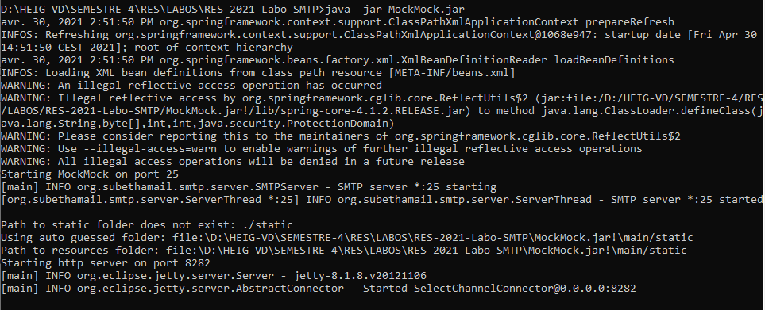
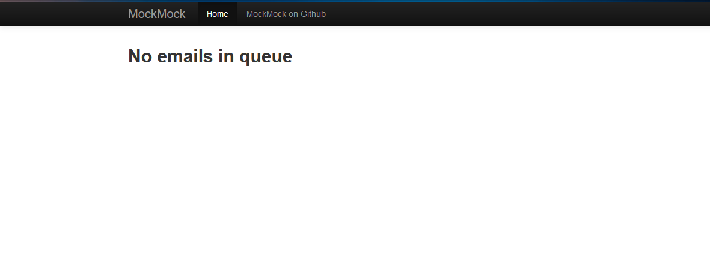
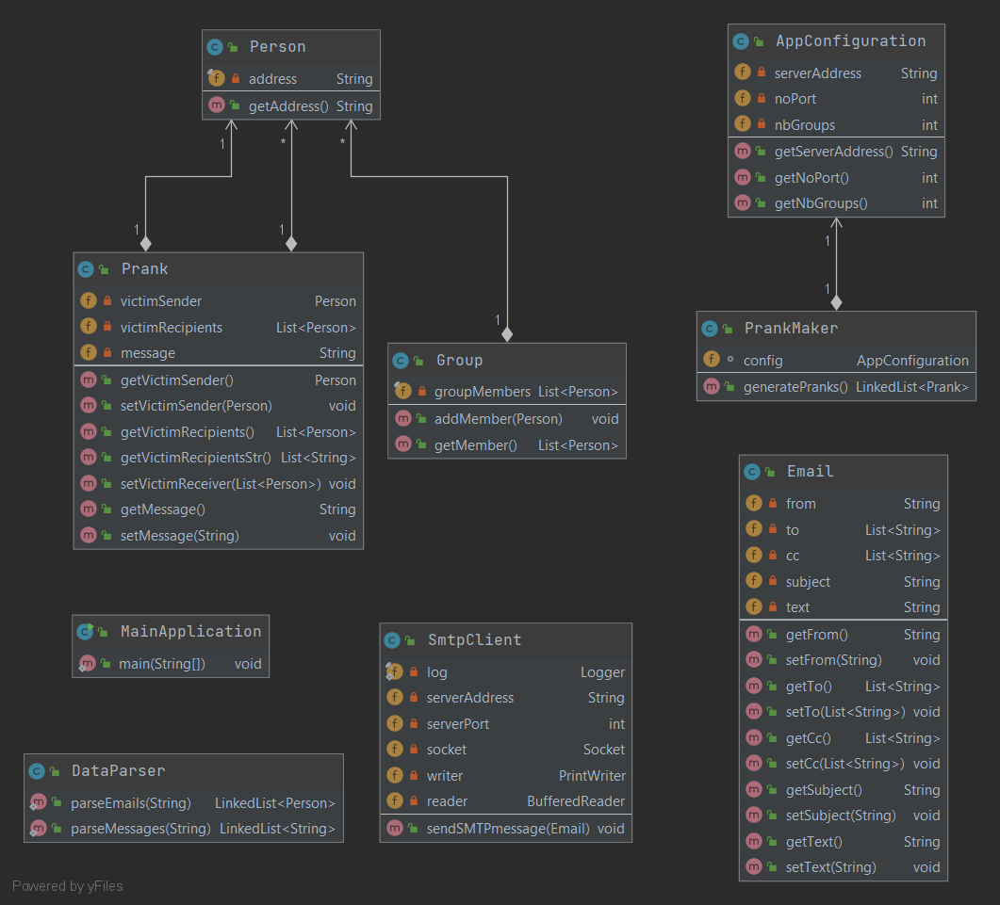

# RES-2021-Labo-SMTP

###### Alessando Parrino & Dylan Canton

###### 30.04.2021

---


## Description of project

This application allows you to send fake prank emails to a group of people.
To do this, you can specify a list of victims to form groups of people. Each group must consist of at least two receivers and one sender belonging to the list of victims, the number of groups created will be specified by the user. The sender victim will send the prank mail to each receiver, the email will contain a subject and content taken randomly from a list of messages. The main purpose is to make the receivers believe that the sender was the author of the message


## Getting Started

### 1. Installation

1. Clone the repo
   ```sh
   git clone https://github.com/Alessandro-AP/RES-2021-Labo-SMTP.git
   ```

2. Execute main's application in  ```MainApplication.java```


---

### 2. Instructions configuration

2. Run the application from the file ```MainApplication.java```

### Instructions configuration

To change the application settings you can edit the **configuration.properties** file where you can define 3 parameters :
- server address
- server port
- number of people groups that the application should create

#### Configure text files

To modify the victims list or the message list that will compose the emails,
it is possible to edit the files contained in the ```/data``` folder, in this folder we find :
- **email.txt :** text files containing the emails of the victims, each email must be separated by a line return.
- **messages.txt :** text file containing the list of messages, as a convention we decided that the first line of the message represents the subject and the rest of the message represents the content of the mail. Each message is separated by a line return and a delimiter ```"---"```.

**Exemple:** <br />
```sh
Dear Tina
I love you.
---
```

---

### 3. Setting up a mock SMTP server


A mockserver is a server, running locally on the machine, which provides services similar to a classic production server. This kind of server is useful during development or just out of curiosity since it simulates  the functionality of a real server.

There is a wide range of mockservers on the web that simulate, for example a mail (SMTP), web (HTTP / HTTPS) server. For more information : https://www.mock-server.com/


In this application, we use *MockMock*, which is a mock SMTP server :

https://github.com/tweakers/MockMock


Two methods of setting up the server are presented here, the user is free to choose the method that suits him, the result being the same.


* #### Basic way

  The basic way is just executing the mockserver on our machine :

  **Important :** You need the java JDK to be able to execute a .jar file on your workstation.

  

  1. First download the MockMock.jar file at https://github.com/tweakers/MockMock, in the section `Installation/Setup`.

  2. Put the file wherever you want and open a terminal in the same folder as the .jar file. 

  3. Finally, execute the following command in the terminal 

     ```
     java -jar MockMock.jar
     ```

  4. You should have the following result at the console, it means that the mockserver started correctly:

     

  5. The mockserver is now started and ready to work. 

     

* #### Docker way

  In this case, we use docker to launch the mockserver in a docker container from a docker image. 
  
  If you are not familiar with docker, take a look at the documentation for the installation :
  
  https://www.docker.com/get-started
  
  
  
  1. Go to the `docker` folder in the project.
  
  2. Open a terminal in this folder.
  
  3. Build the docker's image by running the `build-image.sh` script.
  
     ```shell
     ./build-image.sh
     ```
  
  4. Start the docker's container by running the `run-container.sh` script. 
  
     ```shell
     ./run-container.sh
     ```
  
  5. You should have the same result at the console as in step 4 in the basic way. 
  
  6. The mockserver is now started and ready to work. 


Once the mockserver has been launched (no matter which way you have chosen), SMTP messages sent to port **25** will be intercepted by the mockserver on port **8282**. 

MockMock provides a web interface to view the received mails, to access them, open a browser and enter the url `localhost:8282`.

You should have the following page in your browser : 



The mockserver is now started and ready to work. Use the browser interface to see and manage emails. 


## Implementation

#### The application has been structured according to the following UML diagram: <br /><br />



### Class descriptions :

* **Person** : This class represents the person victim, it has an email address (the address should be valid).<br />
* **Group** : This class represents groups of people who are victims.<br />
* **Prank** : This class represents the prank that will appear in the email, it is composed of the victim sender, a list of victim receivers and the prank message.<br />
* **Email** : This class represents a real email, it consists of a recipient a list of recipients, a list of CC, a subject and a content.<br />
* **DataParser** : Class that takes care of parse our ```.txt``` files (contained in the ```/data``` folder) into Java objects.<br />
* **AppConfiguration** : This class contains the system configurations defined in the file **config.proprieties**.<br />
* **PrankMaker** : This class generates **"Prank"** randomly.<br />
* **SmtpClient** : **SMTP client** that takes care of sending emails, it is built using **Java Sockets** and requires an **IP address** and a **port**.<br />
* **MainApplication** : The main class of the application, it uses **AppConfiguration** class to retrieve information about the server, then generates pranks through the **PrankMaker** and uses them to form emails objects. At last, the SMTP client retrieves these mails in order to send them. <br />

